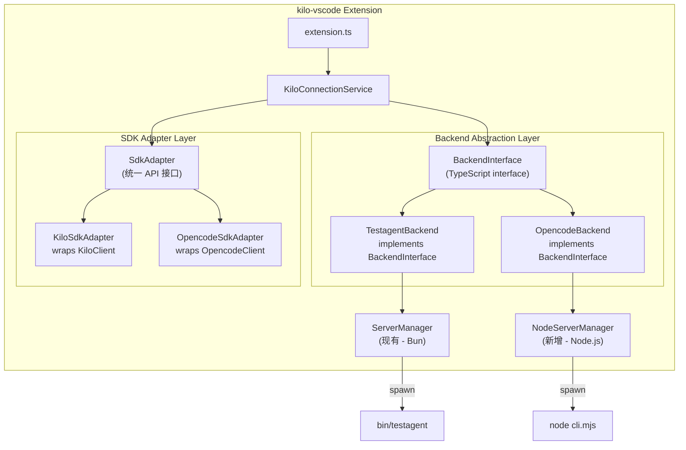
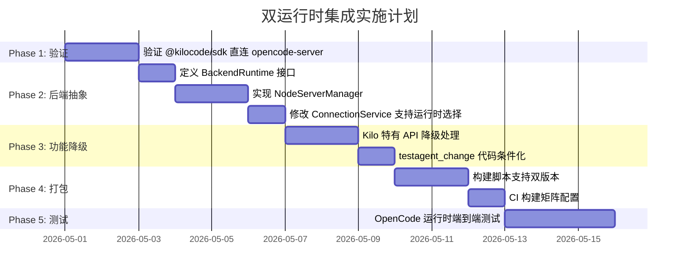

# 双运行时 kilo-vscode 集成方案：Testagent (Bun) + OpenCode (Node.js)

## 目标

让 `packages/kilo-vscode` 同时支持两种后端运行时：
1. **Testagent (Bun)** — 现有方案，spawn `bin/testagent` 二进制
2. **OpenCode (Node.js)** — 新方案，spawn `node --experimental-sqlite cli.mjs`

打包时生成两个版本的 VSIX，或在运行时通过配置切换后端。

---

## 核心对比分析

### 服务端启动差异

| 维度 | Testagent (Bun) | OpenCode (Node.js) |
|------|----------------|-------------------|
| **二进制** | `bin/testagent` (单个 179MB 可执行文件) | `node --experimental-sqlite cli.mjs` (Node.js + JS bundle) |
| **启动命令** | `testagent serve --port 0` | `node --experimental-sqlite cli.mjs --port 0` |
| **stdout 格式** | `"kilo server listening on http://127.0.0.1:PORT"` | `"opencode server listening on http://127.0.0.1:PORT"` |
| **密码传递** | `OPENCODE_SERVER_PASSWORD` env | `--password` flag 或 `OPENCODE_SERVER_PASSWORD` env |
| **默认端口** | 0 (随机) | 4096 |
| **认证头** | `x-kilo-directory` | `x-opencode-directory` |
| **依赖** | 无（自包含 Bun 二进制） | Node.js >= 22.5.0 + node_modules |

### SDK 差异

| 维度 | `@kilocode/sdk` | `@opencode-ai/sdk` |
|------|----------------|-------------------|
| **包名** | `@kilocode/sdk/v2/client` | `@opencode-ai/sdk/v2/client` |
| **客户端类** | `KiloClient` | `OpencodeClient` |
| **工厂函数** | `createKiloClient()` | `createOpencodeClient()` |
| **目录头** | `x-kilo-directory` | `x-opencode-directory` |
| **Kilo 特有 API** | `kilo.*`, `kilocode.*`, `cloud.*`, `claw.*`, `remote.*`, `commitMessage.*`, `enhancePrompt.*`, `suggestion.*`, `telemetry.*`, `network.*` | 无 |
| **Opencode 特有** | 无 | `sync.*`, `history.*` |
| **共有核心** | `session.*`, `config.*`, `provider.*`, `global.*`, `permission.*`, `question.*`, `mcp.*`, `project.*`, `pty.*`, `tool.*`, `event.*`, `file.*`, `find.*`, `vcs.*`, `command.*`, `path.*`, `instance.*`, `lsp.*`, `formatter.*`, `worktree.*`, `auth.*`, `app.*`, `experimental.*` | ✅ 同 |

> **关键发现**: 两个 SDK 的**核心 API 完全同构**（session、config、provider、global events 等），差异仅在于：
> 1. 类名/函数名重命名 (`KiloClient` vs `OpencodeClient`)
> 2. HTTP header 名称 (`x-kilo-*` vs `x-opencode-*`)
> 3. Kilo 有扩展 API（gateway、cloud、telemetry 等）

---

## 推荐方案：抽象层 + 运行时切换

### 架构设计



### 实现步骤

#### Phase 1: 定义后端抽象接口

创建 [src/services/cli-backend/backend.ts](file:///Users/lujs/testagent-kilo/packages/kilo-vscode/src/services/cli-backend/backend.ts)：

```typescript
// Backend runtime abstraction
export interface BackendConfig {
  type: "testagent" | "opencode"
}

export interface ServerInstance {
  port: number
  password: string
  process: ChildProcess
}

export interface BackendRuntime {
  /** Start the server process, return port + password */
  startServer(context: vscode.ExtensionContext): Promise<ServerInstance>
  
  /** Create SDK client for this backend */
  createClient(baseUrl: string, password: string): UnifiedClient
  
  /** Create SSE adapter for real-time events */
  createSSEAdapter(client: UnifiedClient): SdkSSEAdapter
  
  /** Parse port from server stdout */
  parseServerPort(output: string): number | null
  
  /** Kill server process */
  dispose(): void
}
```

#### Phase 2: 统一 SDK 适配层

两个 SDK 的 API 形状几乎完全一致，核心差异只是类名和 header。方案有两种：

**方案 A（推荐）：直接使用 `@kilocode/sdk` 连接 opencode-server**

> [!IMPORTANT]
> 由于两个 SDK 都是从同一个 OpenAPI spec 生成的，REST API 的路由和参数结构完全一致。`@kilocode/sdk` 的 `createKiloClient()` 在连接 opencode-server 时**应该直接可用**，因为底层 HTTP 请求格式相同。唯一区别是 `x-kilo-directory` vs `x-opencode-directory` header，但 opencode-server 可能两者都接受（同源代码）。

验证步骤：
1. 启动 opencode-server：`node --experimental-sqlite cli.mjs --port 4096 --password test123`
2. 用 `@kilocode/sdk` 连接：`createKiloClient({ baseUrl: "http://127.0.0.1:4096", headers: { Authorization: "Basic ..." } })`
3. 测试 `client.session.list()` — 如果返回正常数据，则无需 SDK 适配层

**方案 B：双 SDK + 类型适配器**

如果直接连接不可行，创建统一接口：

```typescript
// src/services/cli-backend/unified-client.ts
export type UnifiedClient = {
  session: { create: ..., list: ..., get: ..., chat: ..., abort: ... }
  config: { get: ..., set: ... }
  global: { event: ..., health: ... }
  provider: { list: ... }
  permission: { list: ..., reply: ... }
  question: { list: ..., reject: ... }
  mcp: { status: ..., connect: ..., disconnect: ... }
  project: { list: ... }
  // ... 共有 API
}
```

#### Phase 3: Node.js ServerManager

创建 [src/services/cli-backend/node-server-manager.ts](file:///Users/lujs/testagent-kilo/packages/kilo-vscode/src/services/cli-backend/node-server-manager.ts)：

```typescript
export class NodeServerManager {
  private instance: ServerInstance | null = null

  private getNodePath(): string {
    // 优先使用系统 Node.js
    // 或使用扩展内嵌的 Node.js
    return "node"
  }

  private getServerDir(): string {
    // opencode-server dist 目录，打包进扩展
    return path.join(this.context.extensionPath, "opencode-server")
  }

  async startServer(): Promise<ServerInstance> {
    const password = crypto.randomBytes(32).toString("hex")
    const serverDir = this.getServerDir()
    const nodePath = this.getNodePath()
    
    const proc = spawn(nodePath, [
      "--experimental-sqlite",
      "cli.mjs",
      "--port", "0",
      "--password", password,
      "--hostname", "127.0.0.1",
    ], {
      cwd: serverDir,
      env: {
        ...process.env,
        OPENCODE_SERVER_PASSWORD: password,
        NODE_OPTIONS: "--experimental-sqlite",
      },
      stdio: ["ignore", "pipe", "pipe"],
    })
    
    // 监听 stdout: "opencode server listening on http://127.0.0.1:PORT"
    // ...
  }
}
```

#### Phase 4: 修改 ConnectionService 支持运行时选择

```diff
// connection-service.ts
export class KiloConnectionService {
+  private readonly runtime: "testagent" | "opencode"
  
  constructor(context: vscode.ExtensionContext) {
+   this.runtime = vscode.workspace
+     .getConfiguration("testagent.new")
+     .get<string>("runtime", "testagent") as "testagent" | "opencode"
+
+   this.serverManager = this.runtime === "opencode"
+     ? new NodeServerManager(context)
+     : new ServerManager(context)
  }
}
```

#### Phase 5: 端口解析兼容

```diff
// server-utils.ts
export function parseServerPort(output: string): number | null {
-  const match = output.match(/listening on http:\/\/[\w.]+:(\d+)/)
+  // 兼容两种格式:
+  // "kilo server listening on http://127.0.0.1:12345"
+  // "opencode server listening on http://127.0.0.1:12345"
+  const match = output.match(/listening on http:\/\/[\w.]+:(\d+)/)
   if (!match) return null
   return parseInt(match[1]!, 10)
 }
```

> [!NOTE]
> 现有的正则 `listening on http://[\w.]+:(\d+)` 已经可以同时匹配两种格式，无需修改！

#### Phase 6: 打包策略

##### 方案 A：单 VSIX + 双运行时

```
packages/kilo-vscode/
├── bin/
│   └── testagent          # Bun 二进制 (现有)
├── opencode-server/       # Node.js 服务端 (新增)
│   ├── cli.mjs
│   ├── node.js            # build-node.ts 的产物
│   ├── package.json
│   └── chunks/            # WASM 资源
│       ├── tree-sitter.wasm
│       └── ...
└── dist/
    └── extension.js
```

优点：单个 VSIX 覆盖所有场景
缺点：VSIX 体积翻倍 (~350MB+)

##### 方案 B（推荐）：构建矩阵生成双版本 VSIX

```yaml
# CI 构建矩阵
matrix:
  runtime:
    - testagent  # → testagent-tscode-{version}.vsix
    - opencode   # → testagent-tscode-opencode-{version}.vsix
```

构建脚本伪代码：
```typescript
// script/package-extension.ts
if (runtime === "opencode") {
  // 1. Build opencode-server: bun run build (in opencode-server/)
  // 2. Copy dist/ → kilo-vscode/opencode-server/
  // 3. Exclude bin/testagent from .vscodeignore
  // 4. Set default runtime = "opencode" in package.json contributes.configuration
} else {
  // 1. Copy testagent binary → kilo-vscode/bin/
  // 2. Exclude opencode-server/ from .vscodeignore
  // 3. Set default runtime = "testagent"
}
```

---

## 需要处理的 Kilo 特有 API

以下 API 存在于 `@kilocode/sdk` 但不在 `@opencode-ai/sdk` 中。使用 opencode 运行时时需要**优雅降级**：

| API 命名空间 | 用途 | 降级策略 |
|-------------|------|---------|
| `client.kilo.profile()` | Kilo Gateway 用户档案 | 返回 null，隐藏 profile UI |
| `client.kilocode.*` | testagent 用户同步 | 跳过 `syncUserId()` |
| `client.cloud.*` | 云端 session 同步 | 隐藏 cloud session 功能 |
| `client.remote.*` | 远程状态服务 | 禁用 `RemoteStatusService` |
| `client.suggestion.*` | 建议/推荐 | 跳过 `drainSuggestions()` |
| `client.telemetry.*` | 遥测代理 | 禁用 `TelemetryProxy` |
| `client.network.*` | 网络等待/拒绝 | 跳过 `drainNetworkWaits()` |
| `client.commitMessage.*` | Git commit 消息生成 | 禁用 commit message 服务 |
| `client.enhancePrompt.*` | Prompt 增强 | 跳过 |
| `client.claw.*` | KiloClaw 面板 | 已禁用 |
| `client.session.viewed()` | 会话可见性跟踪 | 跳过 `flushViewed()` |

---

## 实现优先级



---

## 具体修改文件清单

### 新增文件

| 文件 | 用途 |
|------|------|
| `src/services/cli-backend/backend.ts` | 后端运行时抽象接口 |
| `src/services/cli-backend/node-server-manager.ts` | Node.js 进程管理 |
| `src/services/cli-backend/runtime-config.ts` | 运行时配置读取 |
| `script/package-nodejs-server.ts` | Node.js 服务器版本打包脚本 |

### 修改文件

| 文件 | 改动 |
|------|------|
| [connection-service.ts](file:///Users/lujs/testagent-kilo/packages/kilo-vscode/src/services/cli-backend/connection-service.ts) | 注入运行时选择，条件化 Kilo 特有调用 |
| [server-manager.ts](file:///Users/lujs/testagent-kilo/packages/kilo-vscode/src/services/cli-backend/server-manager.ts) | 提取为基类或接口 |
| [extension.ts](file:///Users/lujs/testagent-kilo/packages/kilo-vscode/src/extension.ts) | 根据运行时配置跳过不支持的服务注册 |
| [KiloProvider.ts](file:///Users/lujs/testagent-kilo/packages/kilo-vscode/src/KiloProvider.ts) | 条件化 `kilo.*` API 调用 |
| `package.json` | 新增 `testagent.new.runtime` 配置项 |
| `.vscodeignore` | 条件排除 bin/ 或 opencode-server/ |
| `esbuild.js` | 可能需要 define 注入运行时标记 |

---

## 关键决策点

> [!WARNING]
> 在开始实施前，需要先确认以下问题：

1. **SDK 兼容性验证**：`@kilocode/sdk` 能否直接连接 opencode-server？这是最关键的前提。如果可以，实现复杂度降低 50%+。

2. **Node.js 分发**：opencode-server 要求 Node.js >= 22.5.0 + `--experimental-sqlite`。扩展是否自带 Node.js？还是依赖用户系统安装？
   - 选项 A：要求用户安装 Node.js 22.5+
   - 选项 B：扩展内嵌 Node.js（增加 ~80MB）
   - 选项 C：使用 VS Code 自带的 Node.js（版本可能不够新）

3. **SSE vs WebSocket**：opencode-server 的 README 提到支持 WebSocket，但 kilo-vscode 当前使用 SSE。opencode-server 的全局事件是走 SSE 还是 WebSocket？
   - 从 [server.ts](file:///Users/lujs/testagent-kilo/packages/testagent-core/packages/opencode/src/server/server.ts) 看，同时支持两种，核心 API 不变

4. **打包产物体积**：opencode-server 的 `dist/` 大小是多少？是否可接受 VSIX 体积？

5. **是否需要运行时切换**：用户是否需要在安装后动态切换？还是安装时就选定了版本？
